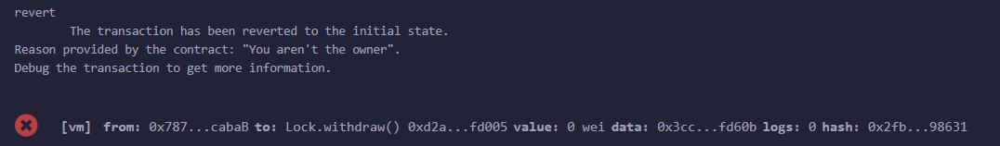
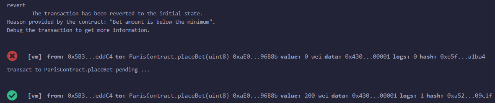

# TP_Blockchaine

## Les contrats

### Lock.sol

Ce contrat Solidity, "Lock", permet au propriétaire de retirer les fonds après une période spécifiée (_unlockTime). La fonction "withdraw" transfère les fonds au propriétaire uniquement si le temps actuel est postérieur à la période de déverrouillage et que l'appelant est le propriétaire.

Il est impossible de déployer ce contrat avec une date passée.


Il n'est pas possible de retirer les fonds avant la date rentrée lors du déploiement.


Il est impossible de retirer les fonds si l'on n'est pas le propriétaire du contrat.



### Secret.sol

Le contrat Solidity "Secret" permet au propriétaire de définir et de récupérer un secret. Seul le propriétaire peut voir ou modifier le secret. La fonction "setSecret" permet de mettre à jour le secret en échange de frais (100 wei), tandis que "getSecret" permet au propriétaire de le voir.

Dans la capture d'écran ci-dessous, l'accès au secret est restreint au seul propriétaire du contrat.


Dans la capture d'écran suivante, on observe que si le solde du propriétaire est insuffisant, la modification du secret lui est refusée.


### BettingContract.sol

Le contrat "BettingContract" permet aux utilisateurs de placer des paris sur deux équipes (TeamA ou TeamB, désignées par 0 ou 1) avant une date limite. Le propriétaire du contrat peut annoncer l'équipe gagnante après la date limite. Les joueurs ayant parié sur l'équipe gagnante peuvent réclamer leur prix, calculé en fonction du montant total misé sur l'équipe gagnante. 

Il faut que la somme pariée soit superieur à la mise minimale (dans le contract déployé ci-dessous, cette mise est de 100 wei)



Un même joueur ne peut pas miser qu'une fois. 


Le propriétaire du contrat ne peut annoncer l'équipe gagnante qu'après la fermeture des paris, à la date limite.


Il n'est pas possible de parié une fois les date limite dépassée.


Seuls les joueurs gagnants peuvent retirer leurs gains après l'annonce du résultat.


Une adresse n'ayant pas jouée ne peu pas retirer de gain.


# Sample Hardhat Project

This project demonstrates a basic Hardhat use case. It comes with a sample contract, a test for that contract, and a script that deploys that contract.

Try running some of the following tasks:

```shell
npx hardhat help
npx hardhat test
REPORT_GAS=true npx hardhat test
npx hardhat node
npx hardhat run scripts/deploy.js
```
